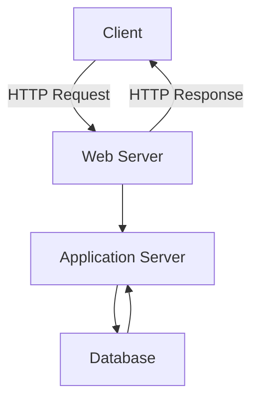

# Build your slides with MkSlides

```bash
mkslides build slides/
```

or if you want to serve them locally:

```bash
mkslides serve slides/
```

---

# Heading size 1
## Heading size 2
### Heading size 3
#### Heading size 4
##### Heading size 5
###### Heading size 6

Lorem ipsum dolor sit amet, consectetur adipiscing elit. Proin quis cursus velit, at lacinia libero. 

Donec fringilla dui vel ligula posuere, eget rhoncus libero semper. Etiam risus libero, consequat porta lacus at, f
aucibus viverra purus. Nulla consectetur mi vestibulum, feugiat risus ac, hendrerit odio.

---

# Code

```java [1-3]
  public class HelloWorld {
    public static void main(String[] args) {
      System.out.println("Hello world!");
    }
  }
```

and `inline` too

---

# Tables

| Header 1 | Header 2 | Header 3 |
|----------|----------|----------|
| Row 1    | Row 1    | Row 1    |
| Row 2    | Row 2    | Row 2    |
| Row 3    | Row 3    | Row 3    |

---

# Diagrams



<div class="mermaid">
<pre class="mermaid">
graph TD;
    A[Client] -->|HTTP Request| B[Web Server];
    B -->|HTTP Response| A;
    B --> C[Application Server];
    C --> D[Database];
    D --> C;
  </pre>
</div>

  ---